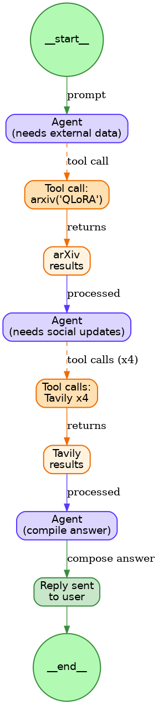

# LangGraph Notebook Answers

## Question #1: How does the model determine which tool to use?

The model uses OpenAI's function calling API. When you bind the tools with `model.bind_tools(tool_belt)`, it converts the LangChain tools into OpenAI function schemas.

The model looks at your query and decides if it needs a tool based on the content. If you ask about research papers, it'll likely use Arxiv. For current events or general web info, it'll use Tavily.

It returns `tool_calls` in the response's `additional_kwargs` when it wants to use a tool. The `should_continue` function then checks for these and routes the graph accordingly.

## Question #2: Is there any specific limit to how many times we can cycle? If not, how could we impose a limit to the number of cycles?

The brakeout room 1 version has no limit. It'll keep cycling indefinitely if the model keeps calling tools.

The `should_continue` function only checks if there are tool calls and continues accordingly.

we can limit it by:
- Adding a counter to the state to track cycles explicitly
- Checking the count in the conditional edge
- Using message count (which is what we did - each back-and-forth adds a message)

## Activity #2: Write out the steps the agent took to arrive at the correct answer

## Question #3: How are the correct answers associated with the questions?

by position in the lists. Question[0] pairs with answer[0], question[1] with answer[1], and so on.

I had some difficulties with this aproach:
- the lists have to stay synchronized
- Adding or removing items can break the pairing
- No explicit connection between questions and answers

(maybe use a dictionary or structured format to explicitly pair them together?)

## Question #4: What are some ways you could improve this metric as-is?

- **Case insensitive matching**: Lowercase both strings before comparison
- **Fuzzy matching**: Handle variations like "4-bit" vs "4bit" 
- **Partial credit**: Score based on percentage of phrases found (2/3 could be 0.67)
- **Semantic similarity**: Use embeddings so "optimizer" matches "optimization"
- **Regular expressions**: Allow more flexible pattern matching
- **Context awareness**: Ensure phrases are used meaningfully, not just mentioned

## Activity #4: Explain what is happening in the `tool_call_or_helpful` function

1. **Tool call check** - If there are tool calls, it routes to "action"

2. **Extracts context** - Grabs the original question and latest answer from the message history

3. **Limiting mechanism** - If there are more than 10 messages, it returns "END" to prevent infinite loops

4. **Self-evaluation** - Uses another LLM call to assess response quality:
   - Creates a prompt asking "is this response extremely helpful? Y/N"
   - Calls GPT-4-mini to judge
   - Checks if "Y" appears in the response

5. **Routing logic**:
   - If "Y" is found: Done, return "end"
   - If "N" is found: Return "continue" so the agent tries again

Basically, the agent becomes self-critical - it evaluates its own responses and iterates until it meets a threshold.

## Activity #5: Write markdown explanations for cells
### (answers also found in the Notebook)

**Cell 65 - Creating the graph and adding nodes**:
Same initialization as before - creates a new StateGraph and adds the two standard nodes (agent and action).

**Cell 67 - Setting the entry point**:
Designates the agent node as the starting point for graph execution.

**Cell 72 - Adding conditional edges**:
Key difference here - uses `tool_call_or_helpful` instead of the simple `should_continue`. This gives us three possible paths:
- "continue": Response wasn't helpful enough, retry
- "action": Tool execution needed
- "end": Task completed successfully

**Cell 74 - Adding edge from action to agent**:
return path - after tool execution, control returns to the agent.

**Cell 76 - Compiling the graph**:
Transforms the graph definition into an executable workflow.

**Cell 78 - Testing the graph**:
Tests with a multi-part question (LoRA, Tim Dettmers, and Attention) to demonstrate how the helpfulness check drives improvement.

## Advanced build tools

- uses these 3 tools for research: `BingSearchRun`, `ArxivQueryRun`, `GoogleScholarQueryRun`

## Langsmith trace of the notebook

- https://smith.langchain.com/public/0ea67c39-61a9-494c-a32e-ff0a83b42729/r

- https://smith.langchain.com/public/a83e6928-708c-402c-b075-6499286cd8b3/r